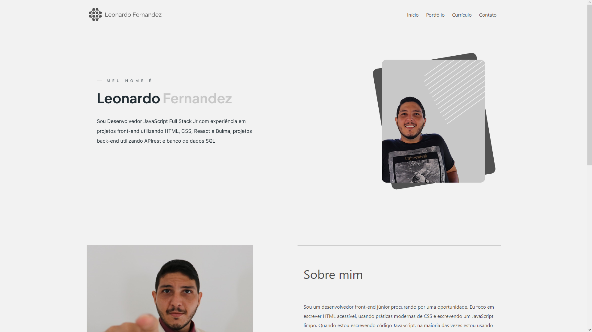

<h1 align="center"> PORTFÓLIO </h1>

Este é um portfolio pessoal que fiz como forma de estudo e desevolvimento das tecnologias de HTML e Bulma. Logo, menos adicionarei as interações com JavaScript.

  <a href="#-tecnologias">Tecnologias</a>&nbsp;&nbsp;&nbsp;|&nbsp;&nbsp;&nbsp;
  <a href="#-projeto">Projeto</a>&nbsp;&nbsp;&nbsp;|&nbsp;&nbsp;&nbsp;
  <a href="#-layout">Layout</a>

 

  

## 🚀 Tecnologias

Esse projeto foi desenvolvido com as seguintes tecnologias:

- HTML
- Bulma
- JavaScript (em breve)
- Git e Github

## 💻 Projeto

O Portfólio é um projeto resultado da aplicação dos estudos em HTML e o framework Bulma, dessa forma foi criada essa página responsiva que se adapta aos diferentes tamanhos de tela.

## 🔖 Layout

O design desse projeto foi inspirado em um modelo de currículo.
